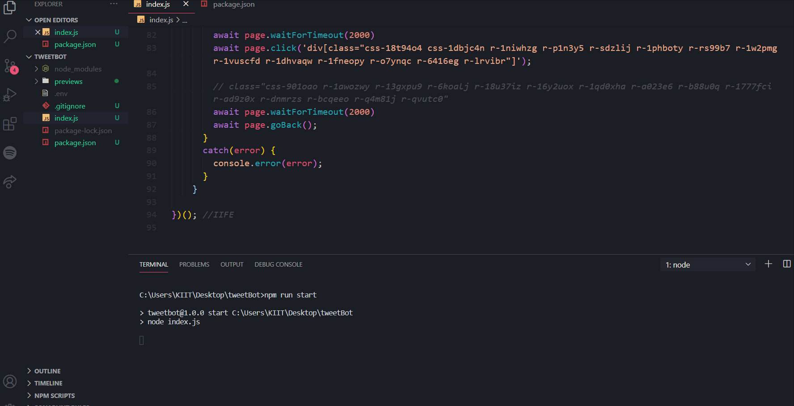

# TweetBot
A basic twitter bot that currently performs automated logins and browses the feed.

## How to run?
* Clone this ```repo```.
* Install the node modules
    * ```bash
        npm install
        ```
* Create a **.env** file and enter the following ``` key=values```
    * ```
        USER_ID=<TwitterUsername>
        USER_PASSWORD=<TwitterPassword>
        ```
* Run the file using the start script :
```bash
    npm run start
```
---
## Bot's Automated Login

> 

---
## Note :
> Bot doesn't use the Twitter API.

**Features to Add**

[x] Automated login with delayed input.

[x] Browsing the feed/ automated scrolling.

[] Retweet specific tweets.

[] Reply to tweets.

---


